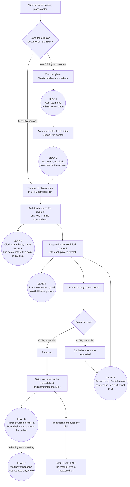

# Ajaia AI Strategist Assessment — Westbrook Health Partners

**Candidate:** [YOUR NAME]
**Video submission folder:** [PASTE SHARED FOLDER LINK HERE — anyone with the link can view]
**Prepared by an Ajaia AI Strategist — https://ajaia.ai**

---

## Task 1. Opportunity triage

### 1.0 The basis I am ranking on

Priya has told her board one thing: **visits per clinician up 20 percent in a year, without hiring clinicians.** That is the only scoreboard that matters, so it is the scoreboard I rank on. Four criteria, applied in this order:

1. **Does it move visits per clinician?** Directly (more patients through the door) or by removing a gate that stops a visit from being booked. Work that saves back-office hours is real money but it is *not* the promise she made, and I will say so where it applies.
2. **Can I measure it with what exists today, or cheaply instrument it?** I will not rank an opportunity above one I can measure just because it sounds bigger. An unmeasurable win cannot be claimed at the board meeting.
3. **Time to first value, and effort.** Anything that returns value inside 30 days outranks a larger item that returns value in six months, because Priya has already been pitched by three vendors and needs one thing to visibly work.
4. **Constraint fit.** Two hard walls from Artifact F: a licensed clinician must attest to anything constituting clinical judgment, and nothing touches PHI without a signed business associate agreement (BAA). An idea that fails either is not an opportunity, it is a liability.

A tiebreak I applied consistently: **when the fix is a required field, a single inbox, or a named owner, I tag it as a process fix and I do not let anyone sell it as AI.** Three of the seven items below are process fixes. That is the honest reading of these materials.

### 1.1 The ranked triage

---

#### #1 — Prior authorization: from clinician order to payer submission

**One line:** Assemble the payer-specific authorization packet automatically from the chart, have the clinician attest to it in one click, and submit it, so nothing is retyped into eight portals and nothing sits waiting on a human to start.

**Tag: AI + automation, with a process fix buried inside it.** The drafting of the medical-necessity narrative and the payer-format mapping are genuine AI work. The submission leg is automation. But the *input* problem — that eight clinicians never put structured clinical data into the EHR — is a process fix, and if it is not solved the AI has nothing to read.

**Evidence:**
- 1,100 authorizations a month across the group (Artifact C).
- The auth team spends most of the week retyping the same clinical information into eight payer portals, each with its own format (Artifact A, direct quote from the COO).
- Nothing can be scheduled until the authorization comes back (situation brief). This is the mechanism that connects it to Priya's metric.
- First-pass approval "somewhere around 70 percent" (Artifact C), meaning roughly 330 authorizations a month go into a rework loop.
- A clinician must attest to the statement of medical necessity; a machine may draft it (Artifact F). This is a clean, legally-defined human gate — rare, and it makes the design decision for me.

**What I am assuming:**
- That the auth team is roughly 5–7 FTE of the 45 operations staff. **Nobody told me this.** It is inferred from "most of their week" plus 1,100 monthly volume. It is the single assumption my dollar figure rests on and it is the first thing I verify.
- That the top 5 payers cover the large majority of volume. Standard for a group this size, unverified here.
- That the EHR exposes an API for reading orders and notes and writing back status. Unverified, and it changes the timeline by weeks.

**Rough worth:**
- **Operations time:** if the auth team is 6 FTE at $71K fully loaded, that is ~$426K a year of labour. A 35 percent reduction in touch-minutes returns ~2 FTE, roughly **$150K a year**, redeployable rather than cut. *This number is only as good as the headcount assumption above.*
- **Cycle time:** I cannot size this yet because **nobody has ever started a clock on an authorization.** The elapsed time from order placed to packet submitted is not measured anywhere. That measurement is week-one work and it is the number I would actually take to the board.
- **First-pass approval:** each point of improvement removes ~11 rework cycles a month. Worth real money, unsizable until the 70 percent figure is trustworthy.

---

#### #2 — Referral intake to scheduled visit

**One line:** Instrument the path from inbound referral to booked appointment, put one named owner and a 48-hour clock on it, and find out how many of the 900 monthly referrals we are losing.

**Tag: process fix first, automation second. Not AI, and not yet.** There is no model to build here until someone can answer how many referrals convert. Right now the first deliverable is a join between two systems and a person whose job it is.

**Evidence:**
- Roughly 900 inbound referrals a month (Artifact C).
- "I cannot tell you how many of those turn into a scheduled visit. Nobody has ever connected those two systems." (Artifact C, the CFO, explicitly.)
- "Sometimes the referral sits, and the patient goes somewhere else, and the referring physician stops sending us anybody. I do not have a number on how often that happens. It happens." (Artifact A.) The COO is describing compounding loss — losing the patient *and* the referral source — and has no measurement of it.

**What I am assuming:** that referrals arrive through a mix of fax, portal and Outlook rather than a single structured channel. Unverified, and it determines whether instrumenting this takes two days or three weeks.

**Rough worth: I cannot size this yet, and that is the finding.** What I can say is the arithmetic. If conversion is currently at 70 percent and we take it to 85, that is ~135 additional patients a month. At an assumed average of six visits per episode of care in an ortho/PT group, that is ~810 visits a month, ~9,700 a year, about **6 percent of total group volume.** Every input to that sentence except the 900 is an assumption. To size it properly I need one thing: a join key between the referral record and the first scheduled encounter, and 90 days of history.

**This is the item most likely to contain Priya's 20 percent, and it is ranked second only because the first 30 days of work on it is measurement rather than building. If the day-30 baseline shows conversion below 70 percent, it becomes #1 and I will say so at that meeting.**

---

#### #3 — No-show recovery and slot backfill

**One line:** Reduce the 14 percent no-show rate and backfill the slots that still go empty from a waitlist.

**Tag: automation, with a possible process fix underneath.** Reminder cadences and waitlist backfill are solved, unglamorous automation. There is no AI requirement here and I would resist one.

**Evidence:** 14 percent no-show rate, and it is **the only number in the entire pack the CFO says he trusts**, because it comes off the schedule rather than out of a human's typing (Artifact C). It bears directly on visits per clinician: an empty slot is a visit that did not happen.

**What I am assuming:** that some reminder system already exists (almost every EHR ships one) and that no waitlist backfill process exists. Both unverified.

**Rough worth:** 55 clinicians × ~2,900 completed visits = ~159,500 visits a year. If 14 percent of *booked* slots no-show, roughly 26,000 slots a year go empty. Recovering 40 percent of them is ~10,400 visits, about **6.5 percent** on Priya's metric. Cheap to attempt, easy to measure, and it does not require a single new system of record.

I have ranked it third rather than first because the value depends entirely on whether an empty slot can actually be refilled at short notice, and nobody has told me whether a waitlist exists.

---

#### #4 — Records requests: one inbox, one owner, one aging alert

**One line:** Consolidate four inboxes into one, name an owner, and alert on anything older than four hours.

**Tag: process fix. Emphatically not AI.** This is the clearest example in the pack of an opportunity that a vendor would try to sell as AI and that is actually a fix costing one afternoon.

**Evidence, and this is where the materials are misleading:**
- The COO calls it "high volume, low value... a grind" and points at the CFO for numbers (Artifact A).
- The CFO reports 1,840 requests last quarter at a **4.2-hour average turnaround** (Artifact C).
- The actual log (Artifact E) shows something completely different. Ten of twelve requests closed in **5 to 13 minutes**, median exactly 10 minutes. Two closed in 3 days 4 hours and 1 day 18 hours. **The mean is an artifact of two outliers.** There is no general slowness problem. There is a tail problem.
- The operations lead names the cause on the log itself: the long ones came into the wrong inbox, or needed a trip back to the clinician.
- Marisol says it out loud in Slack: most take her about five minutes, "it is the ones that fall in a hole that kill us." Rick names the fix and the reason it has not happened: "we keep saying we will make one inbox and then nobody owns it."

**Worth:** trivial in labour terms. Ten minutes times 1,840 is not a business case. The value is in the tail — an attorney's request sitting three days, and the reputational and possible compliance exposure that carries. **I would do it in week one anyway**, because it costs almost nothing, it visibly fixes something the staff have complained about for months, and it buys the credibility I will need in week six when I ask them to change how authorizations are handled.

**Note the discrepancy:** the twelve-request sample averages 9.96 hours, not 4.2. Either the sample is unrepresentative, or the log measures business hours while my arithmetic measures wall clock. I need to ask.

---

#### #5 — The Prior Auth Tracker spreadsheet

**One line:** Do not replace the spreadsheet. Find out what the notes column is holding that the EHR has no field for, then add that field.

**Tag: process fix, deferred, and absorbed into #1.**

**Evidence:** everything in the workbook also exists in the EHR and some of it in the payer portals; the three disagree often enough that operations treats the spreadsheet as the real one — **because it is the only place the notes column exists** (Artifact D). Nine people hold edit access, four use it daily.

**What I am assuming:** that the notes column contains payer-specific state — who was called, what the reviewer said, what the reference number is — that the EHR has no structured home for. This is inferred from the fact that ops trusts the messiest source over the system of record.

**Worth:** not a standalone project. It is a diagnostic. The spreadsheet is not the problem, it is the symptom, and it is the single most useful artifact in the pack because it tells you exactly which field the system of record is missing. Any replacement that does not carry the notes field on day one will be ignored, and the spreadsheet will survive. **The correct output here is a field specification, not software.**

---

#### #6 — Chart closure among the eight high-volume clinicians

**One line:** Eight of 55 clinicians document outside the EHR on their own templates and batch on weekends, so the auth team frequently has nothing to work from.

**Tag: process fix — and see the next section, because my recommendation is largely to leave it alone.**

**Evidence:** Rick, directly: "this is like 8 of the 55 clinicians, but they are 8 of the highest volume ones." Tanya has a patient on the phone asking when she can schedule and has nothing to tell her. The COO already knows and has already decided: "The high-volume ones have their own way of working and I am not going to break what is working for them."

**Worth:** unsizable as a standalone item, and it should not be one. It is a **design constraint on #1**, not a project. If roughly 15 percent of clinicians — and disproportionately the busiest — generate authorization requests with no structured clinical input, then any system I build for prior auth must handle that path explicitly rather than assume it away.

---

#### #7 — The three AI platforms Priya has already been pitched

**One line:** Ambient clinical documentation and similar vendor platforms.

**Tag: AI. Defer, do not buy yet.**

**Evidence for deferring:** the CFO states plainly that nobody tracks how clinicians spend their non-clinical time, and that he does not know the denominator for "visits per clinician" today (Artifact C). The compliance officer states that she does not know what tools people are already using and wants that answer before patient information goes anywhere new (Artifact F).

**Worth:** possibly substantial. **Unclaimable.** You cannot buy a documentation-time product and then demonstrate it returned clinician time when no one has ever measured clinician time. Priya would pay for it and have nothing to show the board. Revisit at day 60, once a baseline exists.

---

### 1.2 What I would not touch

**The eight high-volume clinicians' documentation workflow. I would not change it, and I would push back on anyone who wants to.**

It is the most tempting item in the pack. It is a visible rule violation, it is the direct cause of the auth team's worst days, and the COO has already told you the official policy supports fixing it. Three reasons not to:

1. **It works against the goal.** These are the highest-volume clinicians in the group. Priya's promise is more visits per clinician. Forcing the eight busiest clinicians onto forms they have explicitly rejected as slowing them down mid-clinic is a plan to reduce visits in order to tidy the data that measures visits.
2. **You will lose.** The COO has already declared she will not break what is working for them. Any initiative that requires her to reverse that position in month one is a bet on political capital I do not have and she does not want to spend.
3. **There is a cheaper answer.** I do not need them to change how they *document*. I need roughly six structured fields at the moment they place an order — procedure, laterality, diagnosis, conservative care tried, duration, and clinical rationale in free text. If that takes under 60 seconds and lives at the point of order rather than inside the note, it is a different ask from the one they refused. And if even that is refused, I build the fallback: the auth team's query goes into a tracked queue with a clock instead of Rick walking over to ask, which at least makes the delay visible and attributable instead of invisible.

**Also deferred:** buying any of the three vendor platforms (no baseline, no BAA inventory), building a replacement for the auth spreadsheet (fix the missing field first), and any work on the remaining seven payer portals until the top five are proven.

**Deliberately out of scope for now:** the 14 percent no-show rate is real and I want it, but it belongs to the scheduling team and can run independently of anything Ajaia builds. I would hand it to Dana as a 30-day internal project rather than make it consulting work.

---

### 1.3 Where these materials contradict each other or mislead

Eight conflicts. For each, the version I am working from.

**1. "Everything lives in the EHR. That is the system of record, that has always been the rule."**
Contradicted twice. Artifact B: eight clinicians document on their own templates and batch on weekends. Artifact D: operations treats a spreadsheet as the real one because the EHR has no notes field.
*Working from:* the EHR is the system of record on paper only. For prior authorization, the operational truth lives in a hand-maintained spreadsheet, and for eight high-volume clinicians the source of truth is the clinician's own template until the weekend. I design for that reality, not the policy.

**2. Records requests take 4.2 hours on average.**
Contradicted by the log the average was drawn from. Median is exactly 10 minutes; the mean is created by two multi-day outliers.
*Working from:* median 10 minutes with a heavy tail. This changes the intervention completely — from "make requests faster," which would have been an automation project, to "stop requests from falling into holes," which is an inbox and an owner.

**3. The 4.2-hour figure does not reconcile with the sample.**
The twelve logged requests average roughly ten hours, not 4.2.
*Working from:* I do not trust either number until I know whether elapsed time is wall clock or business hours, and whether the sample is representative. Flagged as a question for the CFO, not treated as a finding.

**4. "The bottleneck is definitely prior authorization."**
Not contradicted on the facts, but misleading about the goal. Prior authorization is done by the auth team, not by clinicians. Fixing it returns operations hours, which is money, and shortens the gate before scheduling, which is visits. But retyping into portals is not clinician capacity, and it is easy to spend a year fixing the loudest complaint in the building and arrive at the board meeting having not moved visits per clinician.
*Working from:* prior auth is my top build, justified by the scheduling gate and by the fact that it is buildable now — **not** by the claim that it is the bottleneck on Priya's metric. I say this on the deck rather than letting her assume otherwise.

**5. First-pass approval "somewhere around 70 percent."**
The CFO does not trust it and explains why: it comes from the EHR, and the EHR only knows what people put into it. Combine that with conflict 1 — eight high-volume clinicians putting comparatively little into it — and the 70 percent is very likely measuring a biased subset of authorizations.
*Working from:* treat 70 percent as unmeasured. Instrument it in week one. I will not put it on a slide as a baseline and I will not commit to improving it until it is real.

**6. Eight payer portals or roughly a dozen?**
The COO says eight. The situation brief says roughly a dozen insurers, one portal each.
*Working from:* neither. I build for the top five by authorization volume and treat the total count as a scoping question. The distinction matters a great deal to the engineering estimate and not at all to the recommendation.

**7. "We should be reaching out within forty-eight hours. Sometimes we do."**
Not contradicted, because it is unfalsifiable. There is no measurement, and the CFO confirms the two systems have never been connected.
*Working from:* treat the 48-hour standard as aspirational and unmeasured. Do not repeat it back to Priya as though it were performance.

**8. The 20 percent target has no denominator.**
The CEO has committed her board to a 20 percent improvement in a metric the CFO cannot currently define: "When Priya says visits per clinician goes up 20 percent, I genuinely do not know what the denominator is today." Completed visits, booked slots and billed encounters are three different numbers with three different answers, and a 14 percent no-show rate sits between two of them.
*Working from:* the target is undefined until she and the CFO agree on the denominator. **This is the most important thing in the pack and it goes on the deck.** It is also a gift: defining the denominator honestly is likely to be the cheapest few points of the 20.

---

## Task 2. Current-state diagram and information gaps

### 2A. Current state — prior authorization, from clinician order to scheduled visit

The workflow I am attacking first. Everything marked **[INFERRED]** is my reading, not something stated in the materials.

#### Actors and systems

| Actor | Role in this flow |
| --- | --- |
| Clinician — 47 of 55 | Documents in the EHR, closes charts same day or near it |
| Clinician — 8 of 55, highest volume | Own note template, batches charts on the weekend (Artifact B) |
| Auth team (part of the 45 ops staff) | Assembles clinical information, submits to payer portals, chases decisions |
| Front desk / scheduling | Cannot book until a decision returns; fields patient calls in the meantime |
| Patient | Waiting, and calling |
| Payer reviewer | Approves, denies, or requests more information |

| System | What it actually holds |
| --- | --- |
| EHR | Charts, orders, scheduling. System of record **on paper**. Incomplete for 8 clinicians |
| Prior Auth Tracker MASTER v7 FINAL.xlsx | The operational truth, because it is the only place the notes column exists |
| ~8–12 payer portals | Submission, status, decision. Each with its own required format |
| Outlook | Where the clinician query happens. Untimed, untracked, unsearchable |
| Shared drive | Where the spreadsheet lives. Nine people with edit access, four daily |

#### The flow

#### The break points, with evidence and confidence

| # | Where it breaks | Who is holding it | Evidence | Confidence |
| --- | --- | --- | --- | --- |
| L1 | Order placed, no structured clinical data exists until the weekend | 8 high-volume clinicians | Artifact B, direct: "he keeps his own note template and batches his charts on the weekend" | **Stated** |
| L2 | The workaround is a verbal question. No record, no timestamp, no owner | Auth team | Artifact B: "so how do we know what he ordered" / "we ask him" | **Stated** |
| L3 | The clock starts when the auth team picks the request up, not when the order was placed | Nobody | **[INFERRED]** — nothing in the pack measures order-to-pickup, and the spreadsheet's first column is *date submitted* | **Inferred — and this is the measurement gap that makes the whole workflow unsizable** |
| L4 | The same clinical content is retyped into each payer's format | Auth team | Artifact A, direct: "most of their week typing the same clinical information into eight different payer portals" | **Stated** |
| L5 | ~30 percent go into a rework loop; denial reasons live in a free-text notes column or nowhere | Auth team | Artifact C (70 percent, explicitly distrusted) + Artifact D (notes column) | **Weak — the rate is not trustworthy** |
| L6 | Three sources of truth disagree. Front desk cannot tell a calling patient anything | Front desk, auth team | Artifact D, direct + Artifact B: "the patient just called asking when she can schedule and I have nothing" | **Stated** |
| L7 | Patient gives up and goes elsewhere while waiting | Nobody | **[INFERRED]** from the referral pattern the COO describes in Artifact A. Not measured for authorizations at all | **Inferred — plausible, unquantified** |

#### What the diagram is really showing

Three things worth saying out loud to Priya.

The retyping everybody complains about is **L4** — one leak of seven, and the only one anybody has mentioned. It is real, and it is the most visible because it is the one that occupies people's hands all week.

The leak that actually costs visits is **L3 plus L7**: the time before anyone starts work, and the patient who stops waiting. Neither is measured. Neither appears in any artifact. Both are invisible precisely because no clock exists.

And **L1** cannot be fixed by asking eight clinicians to behave differently. It has to be designed around.

---

### 2B. Information gaps

Eleven questions. Each one changes the plan, or I would not ask it.

| # | Question | Ask | What changes depending on the answer |
| --- | --- | --- | --- |
| 1 | What is the denominator for "visits per clinician" — completed visits, booked slots, or billed encounters — and over what period? | Priya and Marcus, together, in the same room | This defines the entire engagement. A 14 percent no-show rate sits between completed and booked, so the choice of denominator moves the target by several points before we do any work. If they cannot agree, my first deliverable is a definition, not a system. |
| 2 | Is the 20 percent a dated board commitment, and would she accept a re-baselined target at day 30? | Priya | If it is a hard board commitment, I sequence for demonstrable wins by the next board meeting and take more risk. If it is directional, I sequence for the largest true gain and re-baseline honestly. These produce different 90-day plans. |
| 3 | How many FTE are on the auth team, and what is the median hands-on time per authorization? | Marcus, then a two-week timer on 50 authorizations | The whole operations-savings case rests on a headcount I inferred. If it is 3 FTE, the savings number roughly halves and prior auth may drop below referrals in the ranking. |
| 4 | Can referral receipt be joined to first scheduled encounter at all, and how do referrals arrive — fax, portal, Outlook? | Marcus and whoever administers the EHR | If a join is possible, referral conversion is a reporting task and I have a baseline in two weeks. If referrals arrive as faxes into an inbox with no identifier, referral intake instrumentation becomes a build of its own and likely moves to #1. |
| 5 | Do the top payers' terms of service permit automated submission, and does any of them offer an API? | Alicia, plus the payer contracts | This is the largest single swing in the engineering estimate. API: clean integration. Terms permit browser automation: fragile but workable. Terms prohibit it: we cut the submission leg entirely and ship packet assembly only, and the value case shrinks to drafting time. |
| 6 | What is the complete list of tools currently touching PHI, and which have a signed BAA? | Alicia | She has told us she does not know, and she wants to. Any tool in use without a BAA is an immediate remediation item that outranks everything on my list. It also determines which vendors are even eligible. |
| 7 | Does the EHR expose an API for reading orders and notes and writing back authorization status, and which vendor and version? | EHR administrator or the vendor | Read-and-write API: 8–10 weeks. Read-only: we can draft but not close the loop, and the spreadsheet survives. No API: this becomes screen automation and I would seriously reconsider the whole item. |
| 8 | Of the authorizations that fail first pass, what are the top denial reasons, and does a denial letter exist anywhere retrievable? | Dana, plus a sample of 100 historical authorizations | If denials are mostly missing information, a completeness checker fixes them and I can commit to a first-pass improvement. If they are payer policy judgements, no model fixes that and I should not promise a number. |
| 9 | What is the minimum set of fields a high-volume clinician would enter at the point of order, in under 60 seconds? | Dana first, then two of the eight clinicians directly | If they will give me six structured fields, L1 closes and the system works for all 55. If they will give me nothing, I build the tracked-query fallback, the value is lower, and I tell Priya that 15 percent of her authorizations will stay slow by design. |
| 10 | Is the records-request elapsed time wall clock or business hours, and is the twelve-request sample representative of the quarter? | The operations lead who attached the note | Determines whether records requests is the one-afternoon fix I believe it is, or something with a real tail I have underestimated. Cheap to answer, and it is the thing I am most confident about, which is exactly why I want to check it. |
| 11 | Does a waitlist exist, and can a same-day cancellation actually be backfilled? | Dana and the scheduling leads | If slots can be backfilled, no-show recovery is worth ~6 percent on Priya's metric and I would push it up the list. If they cannot be, reminders reduce a number without adding a single visit and the item is close to worthless. |

Two questions I deliberately did **not** ask: which of the three vendor platforms she liked best, and what her budget is. Neither changes what I would recommend this month, and asking the first one invites her to make the choice before the baseline exists.

---

## Task 3. The CEO deck

Submitted as a separate file: **`Westbrook_CEO_Deck.pptx`** (PDF version also included).

---

## Task 4. Build specification — prior authorization packet assembly and submission

**For:** forward deployed engineering partner
**Item:** #1 from the triage
**Phase 1 scope:** top 5 payers by authorization volume

### 4.1 The outcome the system must produce

> For every clinician order that requires prior authorization, a complete, payer-correct submission packet exists, has been attested by a licensed clinician, and has been submitted to the payer **within four business hours of the order being placed** — and the current status of that authorization is visible in the EHR to anyone who answers the phone, without any human retyping clinical information into a portal.

Three properties of that sentence matter and none of them are features.

The clock starts at **order placed**, not at auth-team pickup. Today nobody measures the gap between those two events, which is where the delay for the eight high-volume clinicians hides. Measuring it is part of the build, not a reporting afterthought.

**Status visible to whoever answers the phone** is in the outcome deliberately. Half the pain in Artifact B is a front-desk person with a patient on the line and nothing to say. A system that cuts submission time but leaves that person blind has not solved the problem people actually have.

**Attested by a licensed clinician** is not a nice-to-have. Artifact F: a machine can draft a statement of medical necessity, a machine cannot attest to it, and that is not a Westbrook policy anyone can waive.

### 4.2 In scope

- Ingest orders requiring prior authorization from the EHR, plus the associated clinical context: diagnosis, laterality, conservative care history, relevant notes, imaging reports.
- A structured order-capture form for use at the point of order, targeted at under 60 seconds, designed for the eight clinicians who do not document in the EHR mid-clinic.
- Draft the medical-necessity narrative, extractively, from the chart.
- Map the packet into each of the top five payers' required formats.
- A completeness and denial-risk check before submission.
- A clinician attestation gate with a full audit record.
- Submission to the payer portal, by API where one exists, by browser automation where terms permit, and by producing a complete copy-ready packet where neither is available.
- Status polling and write-back into the EHR, including the free-text notes field that currently only exists in the spreadsheet.
- The authorization clock: order timestamp, pickup timestamp, attestation timestamp, submission timestamp, decision timestamp, per authorization, per payer, per clinician.

### 4.3 Explicitly out of scope

- **Appeals and peer-to-peer review.** Different workflow, different clinical involvement, and it would double the phase.
- **Any judgement about whether a procedure is clinically indicated.** The system assembles and drafts. It does not decide.
- **Payers six through twelve.** Not until the top five are in production and the field-mapping maintenance burden is understood in practice.
- **Migrating the Prior Auth Tracker spreadsheet.** We do not migrate it, we make it unnecessary by carrying the notes field. If ops still opens the spreadsheet at day 60, the build failed and I want to know that rather than have it forced out of use.
- **Changing how the eight high-volume clinicians write their notes.** Out of scope by explicit decision, not by omission. Read the triage.
- **Scheduling, referrals, records requests, no-shows.** Separate items.
- **Any model fine-tuned on patient data** in phase 1. Retrieval and templating with a general model under a BAA; nothing that puts PHI into a training set.

### 4.4 Systems, data, and what has to be true

| System | Access needed | Risk |
| --- | --- | --- |
| EHR | Read: orders, notes, problem list, imaging reports, coverage. Write: auth status, notes, attachments | **Highest.** If there is no write-back API the spreadsheet survives and the outcome above is not achievable as written |
| Payer portals, top 5 | Submission and status | Terms of service may prohibit automation. Unknown today |
| Identity | Clinician identity for attestation | Must be the actual licensed clinician, not a shared operations login |

**What has to be true about the data, or this does not work at all:**

1. Every order requiring authorization is identifiable **as an order in the EHR at the time it is placed** — including for the eight clinicians. If their orders only materialise on the weekend with the chart, the four-hour target is unreachable for their patients and we must say so before we commit to it.
2. Payer identity and member ID are present and correct on the encounter. If coverage data is stale, we will build correct packets and send them to the wrong payer.
3. A maintained mapping of payer to required fields exists, **with a named human owner at Westbrook.** Payers change their requirements. This is not a one-time build artifact, it is an ongoing responsibility, and if nobody owns it the system degrades silently over about six months.
4. Every component in the data path is covered by a signed BAA, confirmed by Alicia in writing, before a single record of live PHI moves.
5. At least 100 historical authorizations with known outcomes and denial reasons are retrievable for the back-test. Without them there is no acceptance criterion for quality, only opinion.

### 4.5 Where a human stays in the loop, and why

**Gate 1 — Clinician attestation. Hard block, non-negotiable, no override.**
The clinician reviews the drafted medical-necessity statement and signs it. The gate exists because Artifact F says a licensed clinician must attest to anything constituting clinical judgement and that this is federal, not policy. Implementation requirements: the clinician's identity is captured, not the operations user's; every clinical assertion in the draft displays its source in the chart beside it, so attestation is review rather than rubber-stamping; and there is **no path to submission without an attestation record.** Not a warning. A block.

**Gate 2 — Auth specialist review before submission, phase 1.**
Every packet is reviewed by a human before it goes to the payer during the first phase. This gate exists for two reasons: it is how we find out what the system gets wrong, and the edits the specialists make are the evaluation data that tells us whether we can ever relax it. Relaxation is a decision made from that data, at a stated threshold, not on a hunch.

**Gate 3 — Low-confidence routing, permanent.**
Any packet the completeness checker scores below threshold, or where a required field was absent and inferred, routes to a human with the specific gap named. The system must be capable of saying "I could not build this one and here is why." A system that always produces something will produce confident garbage on the cases that matter most.

### 4.6 Acceptance criteria

Testable. If an engineer cannot run it, it is not on this list.

**Quality**
1. On a held-out set of 100 historical authorizations across the top five payers, a blinded auth specialist rates the generated packet **submission-ready without edits in at least 80 percent** of cases.
2. **Zero fabricated clinical content.** Every clinical assertion in a generated narrative traces to a source field or document in the chart, and the trace is visible in the attestation UI. Tested by adversarial review of 50 packets, including 10 with deliberately sparse charts. **Any fabrication is a release blocker, not a bug.**
3. The completeness checker flags at least **90 percent** of packets that were historically denied for missing or insufficient information, on a labelled back-test, at a false-positive rate under 20 percent.

**Cycle time**
4. Median time from **order placed** to **submitted** is **four business hours or less**, measured on the authorization clock, over 30 consecutive production days. Reported separately for the eight batching clinicians and the other 47, because those are different problems and one average will hide the failure.
5. At least **90 percent** of authorizations are submitted the same business day.

**Compliance and integrity**
6. **100 percent** of submitted packets carry an attestation record with clinician identity and timestamp. Zero submissions without one. Verified by querying the audit log for orphans.
7. A data-flow review, signed by Alicia, confirms no PHI reaches a system without a BAA.
8. Status for any open authorization is retrievable in the EHR within 60 seconds of a portal status change, or within one stated polling interval, whichever applies to that payer.

**Adoption — the criterion most likely to be dropped and the one I most want kept**
9. At day 60, **fewer than 10 percent of open authorizations have any manual edit in the Prior Auth Tracker spreadsheet**, measured by file access and edit telemetry on the shared drive. If ops is still keeping the spreadsheet, the system is missing something they need — almost certainly the notes field — and the project has not delivered regardless of what the cycle-time chart says.

### 4.7 The three ways this most likely fails in production

**Failure 1 — The system invents clinical content, a clinician signs it, and it goes to a payer.**
The worst outcome available here. Not an inconvenience; a clinician has attested to something untrue in a medical record. Likely because sparse charts create pressure to produce a plausible narrative.
*Build to catch it:* extractive generation only, with span-level citation from every assertion to its source. A validator that rejects any sentence with no source span, before a human ever sees it. The attestation UI shows source text beside each claim so review is possible in seconds rather than requiring the clinician to reconstruct the chart. And a hard rule: **when the chart does not support a medical-necessity statement, the system routes to a human and says so.** It never fills the gap.

**Failure 2 — Silent input gap on the eight high-volume clinicians.**
The system builds packets from stale or absent data for the clinicians who generate the most volume, and either produces weak packets that get denied or quietly stalls. This is the most likely failure by ordinary probability, because the input problem is a known unresolved constraint we chose to design around rather than fix.
*Build to catch it:* a preflight that **refuses to build** when required fields are missing, rather than proceeding on inference. A tracked clinician-query queue with its own SLA clock and escalation, replacing Rick walking over to ask. A per-clinician missing-data dashboard so the pattern is visible and attributable, which is also the evidence base for a later conversation with those eight. And cycle-time reporting split by clinician cohort, so their delays never average into invisibility.

**Failure 3 — Payer portal drift.**
A payer changes a form field, a session flow, or adds a challenge, and submissions break silently. The queue backs up for two days before anyone notices. This is not a possibility, it is a certainty on a long enough timeline; the only question is detection time.
*Build to catch it:* a daily canary submission per payer against a test or benign path. A structural diff on each portal's form, alerting on change. Alert on submission-failure rate and on any drop in submissions-per-hour, not only on hard errors — silent partial failures are the dangerous ones. And a **manual fallback that is always available**: when automation fails, the system still produces the complete, formatted, attested packet for a human to submit by hand. A broken robot must degrade into a fast human process, never into a stopped queue.

**Failure 4, which I am naming anyway because it is the one that actually kills projects like this** — the auth team keeps using the spreadsheet, because the notes column still has no home. Covered by acceptance criterion 9. Build the notes field on day one, not in phase 2.

### 4.8 What I need from the client before day one

1. EHR vendor, version, API documentation, sandbox environment, and credentials.
2. Written confirmation from Alicia of BAA status for every component in the proposed data path.
3. Authorization volume ranked by payer for the last 12 months, to fix the top five.
4. 100 historical authorizations with outcomes and denial reasons.
5. Terms of service review for the top five payer portals, specifically on automated access.
6. A named business owner at Westbrook for the payer field mapping — a person, with time allocated, not a team.
7. A decision on the point-of-order capture form: are the eight clinicians in or out? We can build either way, but not both, and the answer changes the value we can promise.
8. Two auth specialists available for four hours a week for shadowing and review.
9. Permission to instrument the authorization clock in week one, before anything else is built. **This is the one item with no workaround.**

### 4.9 The condition under which I would kill this

Three, stated in advance so that stopping is a decision rather than an admission.

**Kill on the baseline.** If the week-one instrumentation shows median order-to-submission is already under four hours and first-pass approval is genuinely above 85 percent, then prior authorization is not the constraint, the complaint is about unpleasantness rather than throughput, and we move the team to referral conversion. I consider this unlikely and I want the measurement anyway, because if I am wrong I would rather find out in week one for the cost of a report than in month six for the cost of a build.

**Kill on access.** If the top five payers all prohibit automated submission and none offers an API, we cut the submission leg and ship packet assembly only. If a two-week pilot of assembly alone does not cut cycle time by at least 40 percent, the remaining value does not justify the integration cost and we stop.

**Kill on inputs.** If the eight high-volume clinicians will not provide structured data at the point of order **and** their orders are not identifiable in the EHR until the weekend, then roughly 15 percent of authorizations — disproportionately the ones attached to the most valuable clinicians — are structurally out of reach. The remaining scope is a back-office efficiency project, which is worth doing but is not worth doing first, and I would reorder the engagement behind referral conversion.

---

## Task 5. AI workflow note

### Tools and models, and where each was used

**Claude Opus 5** did the bulk of the drafting work, on three of the four tasks.

On **Task 1**, I used it to get a first structure onto the page and then as an adversary. The most useful prompt I ran was not "help me rank these" but "make the strongest possible case that referral conversion should be first, not prior auth." That argument was good enough that it changed the submission: the triage now says explicitly that referrals become #1 if the day-30 baseline comes in below 70 percent, and the deck carries a day-30 re-rank as a stated mitigation. Without that pass the ranking would have read as more settled than the evidence supports.

On **Task 2**, I used it for Mermaid syntax and for a first pass at the information gaps. I then cut roughly a third of the questions it generated, on the test the assignment sets: a question that does not change the plan is not worth asking. The ones I cut were things like "what is your budget" and "which vendor did you prefer" — reasonable-sounding, and they change nothing about what I would recommend this month.

On **Task 4**, I used it to convert my acceptance criteria from prose into a form an engineer could actually test, and to pressure-test the failure modes for anything obvious I had missed. It caught nothing I had not already listed, which I took as a reasonable signal rather than a waste.

On **Task 3**, I used it for the deck build and layout, and for compression — cutting slide copy down until each slide made one point.

### What I kept human, and why

Every judgement call, and specifically these four.

**The ranking basis.** A model will happily rank things. It will not decide that the only scoreboard that matters is the promise Priya made her board, and then hold that line through an item like records requests, where the honest answer is "worth almost nothing, do it in week one anyway." That decision determines the whole submission and it is not a drafting task.

**The decision to leave the eight high-volume clinicians alone.** Every model I asked wanted to fix them, because it is a visible rule violation with an obvious remedy. The remedy is wrong: it slows down the busiest clinicians in a group whose stated goal is more visits per clinician, and the COO has already refused it. That is a read on organisational reality and a read on what Dana will actually back, and neither is in the artifacts.

**Which number to commit to.** Committing to 20 percent would have been the easy, agreeable output. Showing the arithmetic to 13–15 percent and naming the missing 5–7 points is the harder one, and it is the one a CEO who has already been pitched three times will believe. That is a judgement about credibility, not about data.

**The failure modes in section 4.7.** Asked for risks, a model produces a list that reads well and warns you about nothing in particular. The three I kept are the ones I expect: the silent input gap on the eight clinicians, payer portal drift, and — the one that actually kills projects like this — the auth team quietly keeping the spreadsheet because the notes column still has no home. That last one became acceptance criterion 9, which is the criterion most likely to get dropped in a planning meeting and the one I most want kept.

### One specific thing I checked, corrected, and rejected

**The records-request numbers, and it changed the recommendation.**

Marcus reports 1,840 requests last quarter at a 4.2-hour average turnaround (Artifact C), and Dana describes it as high-volume, low-value grind work. The first draft I got back treated that as given and proposed request triage and automated routing — a plausible-sounding AI project built on an average nobody had opened.

I recomputed Artifact E by hand rather than trusting a summary. Twelve requests: ten closed between 5 and 13 minutes, **median exactly 10 minutes**. Two closed at 3 days 4 hours and 1 day 18 hours. Those two outliers are 7,080 of the 7,168 total minutes in the sample — **98.8 percent of the elapsed time sits in 17 percent of the requests.**

Three consequences, in order of how much they changed the submission.

I **rejected** the automation project. There is no general slowness problem to automate. There is a tail problem, and the operations lead names the cause on the log itself: wrong inbox, or a trip back to the clinician. Rick names the fix and the reason it has not happened — "we keep saying we will make one inbox and then nobody owns it." That is one inbox, one named owner, one aging alert. It costs an afternoon, and it is item #4 in the triage tagged process fix, not AI.

I **corrected** my own draft twice. I originally wrote the median as roughly 9 minutes by eye; recomputing gave exactly 10. Small, but it is a number that would have appeared on a slide, and being loose about the one figure I am using to accuse someone else of being loose is not a position I want to defend in front of a CFO.

And I **flagged** something I could not resolve. The sample's own mean is 9.96 hours, not 4.2. Either the twelve requests are unrepresentative of the quarter, or the log measures business hours where my arithmetic measures wall clock. I do not know which, so it is question 10 in the information gaps rather than a finding. It is also the item I am most confident about overall, which is exactly why I wanted it checked.

### What I would not use AI for on a real version of this engagement

Anything that puts patient information into a tool without a signed business associate agreement. That is the whole substance of Alicia's note, and it is why a shadow-IT and BAA inventory sits in week one of the plan rather than in a compliance appendix. Every artifact in this pack is fictional and none of it carried protected health information. On the real Westbrook, that constraint governs tool selection from day one and it does not bend for convenience.

---

*Prepared by an Ajaia AI Strategist — https://ajaia.ai*
